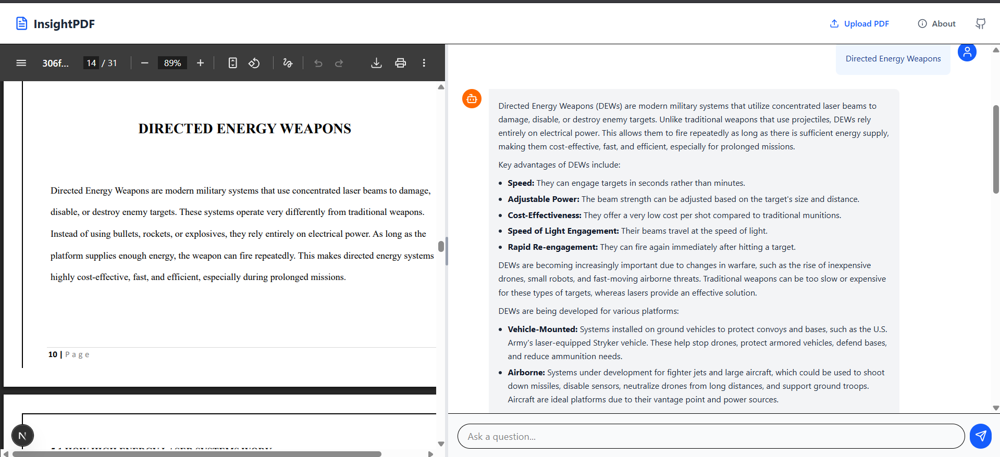

# Engineering Log: InsightPDF

## Project Setup
Created the folder and file elementary structure

---

## [Date: 02-02-2026] - Session 1: The AI Core

**Goal:** Implement the basic RAG pipeline (Ingestion + Retrieval) in Python.


### Things I Learned

#### RAG (Retrieval Augmented Generation)
RAG is simply giving AI an open book, so that it can update its knowledge and generate better answers.
- **Retrieval** - Find info
- **Augment** - Use this info to update knowledge
- **Generate** - Generate new answer

#### LangChain
It is a way to chain together different AI tools together

---

### How I Built It

#### Step 1: Library Setup
I defined the libraries to setup the RAG Engine

- **Loaders and Splitters** - They'll load text from document and split them into chunks
- **The AI Models** - Used Gemini for the main BRAIN and HuggingFace for embeddings
- **DB and Parsers** - Used for storing and prompting the engine

#### Step 2: RagEngine Class
Defined a class RagEngine

**Step 2.1 - Constructor Initialization:**
- HuggingFace embeddings model MINILM
- Gemini, with temp = 0 to give actual answers
- VectorDB - Chroma
- Turned the DB into a retriever to look for the 3 most relevant chunks as per our contexts

**Step 2.2 - Ingestion Function:**
- Split the PDF into chunks of 1000 char with 200 overlapping char to store into our database

**Step 2.3 - Chat Function with LLM:**
- Defined the prompt in which I added the context, the question and a prompt template which will directly go to GEMINI
- Made a chain where: Retrieval → Prompt → LLM → Answer

### Understanding the Chain Pipeline

**What happens when you ask a question:**

1. **Retrieval Step** - `self.retriever`
   - Converts your question into an embedding (numbers)
   - Searches ChromaDB for similar embeddings
   - Returns the top 3 most relevant text chunks

2. **Prompt Step** - `prompt`
   - Takes the retrieved chunks and your original question
   - Fills them into the template: "Context: {chunks}, Question: {your question}"

3. **LLM Step** - `self.llm`
   - Sends the formatted prompt to Gemini
   - Gemini reads the context and generates an answer

4. **Parser Step** - `StrOutputParser()`
   - Converts Gemini's response into plain text string

**Simple Flow:**
Question → Find Relevant Chunks → Build Prompt → Ask Gemini → Get Answer


_**Note:** `RunnablePassthrough()` just passes your original question through unchanged so it can be inserted into the prompt template alongside the retrieved chunks._

---

## [Date: 03-02-2026] - Session 2: The Systems Bridge (FastAPI)

**Goal:** Turn the Python script into a Web API that can accept files and questions from the outside world.

### Things I Learned

#### 1. Why FastAPI?
I chose FastAPI over other options (like Flask or Django) because:

- **Speed** - It is incredibly fast
- **Async/Await** - It can handle a file upload in the background while simultaneously answering a chat question. It doesn't freeze up
- **Auto-Documentation** - It automatically writes the instruction manual (Swagger UI) for my API, saving me hours of work

#### 3. Pydantic
This is the "Bouncer" at the club. Python is usually loose with data types, but Pydantic enforces strict rules. If I say `question: str`, and someone sends a number, Pydantic stops them at the door. It prevents my code from crashing due to bad input.

---

### How I Built It (main.py)
I wrapped my RAG engine in a web server. Here is the human-readable logic:

#### The Setup
I initialized the FastAPI app and started my RagEngine once at the top. This keeps the "Brain" alive so it doesn't have to wake up from scratch for every single user.

#### The "Upload" Route (POST /upload)

- **Input:** A file (specifically a PDF)
- **The Problem:** Files sent over the internet arrive as "streams" (packets of data in RAM). My PDF reader needs a real file on the hard drive
- **The Fix:** I used shutil to copy the stream from RAM to a temporary file on the disk (temp.pdf)
- **The Action:** I told the engine to read that temp file, then immediately deleted it to keep the server clean

#### The "Chat" Route (POST /chat)

- **Input:** A strict JSON object: `{ "question": "..." }`
- **The Action:** It takes the text string, passes it to `rag_engine.chat()`, and returns the answer as JSON

---

### How I Tested It (Swagger UI)
I didn't need to build a frontend website to test my code. FastAPI has a built-in feature called Swagger UI.

- **What it is:** A visual dashboard that reads my code and automatically generates buttons for every function I wrote
- **URL:** http://localhost:8000/docs

#### My Test:

1. I went to the `/upload` section and uploaded a [sample PDF](backend/sample.pdf) it is a PDF about cells of plants and animals
2. I received a 200 OK success message
3. I went to the `/chat` section and sent a JSON question: `{ "question": "What are the major differences in Plant vs Animal cells?" }`
4. Gemini answered correctly based only on the PDF I uploaded!


below are the question and answers 


---

## [Date: 04-02-2026] - Session 3: The Full Stack & Intelligence Upgrade

**Goal:** Transform the raw API into a complete, user-friendly "Copilot" application with a real interface, memory, and split-screen workflow.

---

### Things I Learned

#### Contextual RAG
A simple "search" isn't enough. If I ask "Explain that," the AI needs to know what "that" refers to. The problem was that my chatbot had amnesia - every question felt like the first time we met.

I learned how to use a **Conversational Retrieval Chain** which rewrites my questions based on conversation history before searching the database. This means if I ask "What's a mitochondria?" and then follow up with "Explain that in simpler terms," the AI knows "that" = "mitochondria."

---

### How I Built It

#### Step 1: The Frontend Formation (The Shell)
I moved from Python to **React/Next.js** to build the visual interface.

**Component Architecture:** I broke the UI into small Lego blocks in `frontend/components`:

- **Header.tsx:** Simple top navigation bar. Nothing fancy, just the app name and a clean header.

- **PDFViewer.tsx:** This was cool! I used a native HTML `<iframe />` to render the PDF blob locally. The file never leaves the user's computer - no external cloud needed. Privacy first!

- **ChatInterface.tsx:** This was the complex part. It handles the message list (user messages vs AI responses), the text input field, send button, and auto-scrolling to the latest message. I spent hours getting the auto-scroll to work smoothly.

**The Layout (page.tsx):** I used **Tailwind CSS Flexbox** to create a responsive split-screen layout that adjusts to the screen size. On desktop, you get the PDF on the left and chat on the right. On mobile, it stacks vertically.

**The Landing Page:** I added a "Welcome State" that shows a clean upload card with instructions. It only transitions into the full workspace view after a file is selected. This makes the app feel more polished instead of showing an empty broken screen.

#### Step 2: The Wiring (Connecting Front & Back)
Now I had two systems - the Python backend and the React frontend - but they couldn't talk to each other yet. Time to build the bridge.

**Backend Update (main.py):** I added **CORSMiddleware** to allow requests from `localhost:3000` (where my frontend runs). Without this, browsers block the requests for security reasons. CORS is basically telling the browser "hey, these two apps are friends, let them talk."

**API Client (api.ts):** Instead of writing messy `fetch` calls everywhere in my React components, I built a dedicated **Axios client** to handle:

- **Multipart file uploads** - Special formatting needed to send PDFs
- **JSON chat requests** - Clean structured data for questions and answers

This keeps my code organized. If I need to change the API URL later, I only update it in one place.

**Feedback Loops:** I added loading states (`isUploading`, `isThinking`) to `ChatInterface.tsx`. Now when you upload a file or ask a question, the user sees a spinner instead of a frozen screen. Small detail, huge difference in user experience.

#### Step 3: The Intelligence Upgrade (Memory)
I went back to the Python core (`rag.py`) to make the AI actually smart about conversations.

**Session Isolation:** I added a `clear_database()` function. Now, every time you upload a new file, it wipes the old data from ChromaDB. This prevents the AI from getting confused and mixing up information from different documents. Each upload is a fresh start.

**History Awareness:** I upgraded the RAG pipeline to use `create_history_aware_retriever`. This was the big brain upgrade.

- **Old Way:** Question → Search → Answer
- **New Way:** History + Question → Rewrite Question → Search → Answer

**Example of how this helps:**
- User: "What is photosynthesis?"
- AI: "It's how plants make food using sunlight..."
- User: "How does that work in detail?"
- Without history: AI searches for "that" (finds nothing relevant)
- With history: AI rewrites to "How does photosynthesis work in detail?" (finds perfect context)

**History Passing:** I updated the frontend to slice the last 6 messages and send them to the backend with every new request. Why only 6? Because sending the entire conversation would be slow and expensive. 6 messages is enough context without bloating the API calls.

#### Step 4: Polish & Stability (The Final Bosses)
This is where I learned that building something is 20% of the work. Making it actually work reliably is the other 80%. I encountered real-world engineering problems:

**Dependency Hell:** My Python environment broke due to version conflicts between LangChain packages. Some tutorials online use old versions, some use new ones, and mixing them crashes everything. 

**The Fix:** I deleted the entire `venv`, created a fresh `requirements.txt` with the modern **LangChain v0.2 stack**, and fixed all the imports. I documented every version number so future me doesn't face the same nightmare.

**Rate Limits:** I hit Google's free tier limit (429 Error) while testing. Turns out `gemini-2.5-flash` has stricter limits.

**The Fix:** I switched to the stable `gemini-2.5-flash-lite` model. It is extremely fast and has generous limits. For a student project, this trade-off makes sense.

**Markdown Support:** The AI was returning nice formatted text with bullet points and bold text, but it was showing up as raw markdown symbols (`**bold**`, `- item`) in the chat.

**The Fix:** I installed `react-markdown` in the frontend. Now the AI's responses render beautifully - bold text is actually bold, lists are properly formatted, code blocks look professional.

**Resizable UI:** I added a "Power User" feature where you can press **Ctrl + Arrow Keys** to dynamically resize the PDF panel width using React state. This was a fun touch - if you want more PDF space, press Ctrl+Right. More chat space? Ctrl+Left. It uses browser `localStorage` to remember your preference even after closing the tab.

---



## [Date: 04-02-2026] - Bug Fix: Duplicate Upload Prevention

**Problem:** When uploading a PDF, I noticed the success message appeared twice in the chat, and the backend was processing the same file twice. This was wasteful and confusing.

**Root Cause:** React 18's Strict Mode intentionally runs `useEffect` hooks twice in development mode to help catch bugs. My upload logic lived inside a `useEffect`, so it triggered twice.

**The Fix:** I added a `useRef` to track whether the upload already happened:
```tsx
const hasUploadedRef = useRef(false);
```

Now the upload check looks like:
```tsx
if (initialFile && !hasUploadedRef.current) {
  hasUploadedRef.current = true;
  handleUpload(initialFile);
}
```

**Why useRef?** Unlike `useState`, `useRef` doesn't trigger re-renders and persists across React's double-invocation in Strict Mode. This is the proper React way to handle "run once" side effects.

**Result:** Upload now happens exactly once, even in development mode. Chat stays clean, and I save unnecessary API calls.


## [Date: 06-02-2026] - Enhancement: PDF Upload Robustness

**Problem:** PDF upload functionality had several potential failure points and security issues.

**Issues Identified:**
1. **Improper temp file handling** - Files saved to current working directory, which may not be writable in Docker
2. **No file validation** - Missing checks for empty files or actual PDF content
3. **No size limits** - Could cause memory overflow with large files
4. **Filename security** - Special characters in filenames could cause file system errors
5. **Race conditions** - Simultaneous uploads with same filename would conflict
6. **Database clearing errors** - `clear_database()` failed on first upload when collection doesn't exist

**Solutions Implemented:**

1. **Proper Temp File Handling** ([main.py](backend/main.py)):
   ```python
   temp_file = tempfile.NamedTemporaryFile(delete=False, suffix=".pdf")
   ```
   - Uses Python's `tempfile` module for OS-appropriate temp directory
   - Guaranteed cleanup even on errors

2. **Comprehensive Validation**:
   - File size limit: 50 MB maximum
   - Empty file check
   - Extension validation (`.pdf` only)
   - Filename sanitization (removes special characters)

3. **Enhanced Error Handling**:
   - Detailed error messages with file size info
   - Proper cleanup in all error scenarios
   - Better logging with traceback

4. **Database Initialization Fix** ([rag.py](backend/rag.py)):
   - Wrapped `delete_collection()` in try-except
   - Handles first upload gracefully when no collection exists

**Benefits:**
- More reliable uploads in Docker environment
- Better user feedback on upload issues
- Protected against malicious or oversized files
- No more race conditions or file conflicts

---

## [Date: 06-02-2026] - Bug Fix: Chat History Format Mismatch

**Problem:** The application was returning 500 errors during chat interactions due to a format mismatch between the API layer and the RAG engine.

**Root Cause:** 
- The API ([main.py](backend/main.py)) sends chat history as a list of tuples: `[("human", "message"), ("ai", "response")]`
- The RAG engine ([rag.py](backend/rag.py)) uses LangChain's `MessagesPlaceholder`, which expects actual message objects: `[HumanMessage(...), AIMessage(...)]`

**Solution:**
Implemented format conversion in the RAG engine's chat method:
```python
formatted_history = []
for role, content in chat_history:
    if role == "human":
        formatted_history.append(HumanMessage(content=content))
    elif role == "ai":
        formatted_history.append(AIMessage(content=content))
```

**Why This Approach:**
- Keeps the API simple (tuples are easier for frontend to work with)
- Encapsulates LangChain-specific logic within the RAG module
- No changes required to frontend or API interface
- Clean separation of concerns

---


**Goal:** Switch from Google Gemini to GROQ API for faster, free LLM inference.

### Why GROQ?

**Advantages over Gemini:**
1. **Speed** - GROQ's LPU (Language Processing Unit) delivers extremely fast inference
2. **Free Tier** - Generous free API quota for development and testing
3. **Powerful Models** - Access to Meta's Llama 3.3 70B model
4. **Reliability** - High uptime and consistent performance

### Implementation Changes:

**1. Environment Variables** :
```env
GROQ_API_KEY="gsk_..."
```

**2. Dependencies** ([requirements.txt](backend/requirements.txt)):
- Removed: `langchain-google-genai`
- Added: `langchain-groq`

**3. RAG Engine** ([rag.py](backend/rag.py)):
```python
# Old (Gemini):
from langchain_google_genai import ChatGoogleGenerativeAI
self.llm = ChatGoogleGenerativeAI(
    model="gemini-2.5-flash-lite",
    temperature=0
)

# New (GROQ):
from langchain_groq import ChatGroq
self.llm = ChatGroq(
    model="llama-3.3-70b-versatile",
    temperature=0,
    api_key=os.getenv("GROQ_API_KEY")
)
```

---

## [Date: 08-02-2026] - Session 4: Production Ready & Final Enhancements

**Goal:** Polish the application with deployment features, fix critical bugs, and prepare for Docker containerization.

### Things I Learned

#### Deployment Considerations
When moving from local development to production, many hidden problems appear. Render's free tier has an ephemeral filesystem, meaning uploaded PDFs disappear when the server restarts. For a demo app, this is acceptable, but production apps need cloud vector databases like Pinecone or Supabase.

#### Math Rendering in Web Apps
LaTeX formulas require special plugins. ReactMarkdown needs `remark-math` and `rehype-katex` to convert `$E=mc^2$` into beautiful rendered equations. Without error handling (`throwOnError: false`), one bad formula can crash the entire UI.

---

### How I Built It

#### Feature 1: Timeout Handling ([api.ts](frontend/lib/api.ts))
**Problem:** Render's free tier "sleeps" after 15 minutes of inactivity and takes 30-50 seconds to wake up. The first API call would timeout.

**Solution:** Added generous timeout to Axios client:
```typescript
const apiClient = axios.create({
  baseURL: process.env.NEXT_PUBLIC_API_URL || "http://localhost:8000",
  timeout: 30000, // Wait 30 seconds for Render wake-up
});
```

#### Feature 2: Enhanced Markdown Rendering ([ChatInterface.tsx](frontend/components/ChatInterface.tsx))
**Problems:** 
- Long URLs broke the chat bubble layout
- Code blocks didn't wrap properly
- No support for tables, blockquotes, or links
- LaTeX math formulas crashed the app on syntax errors

**Solutions:**
1. **Word Breaking:** Added `break-words` and `break-all` classes to prevent overflow
2. **Math Rendering:** Configured KaTeX with error tolerance:
   ```tsx
   rehypePlugins={[[rehypeKatex, { strict: false, throwOnError: false }]]}
   ```
3. **Complete Markdown Support:** Added custom components for tables, links, blockquotes, and horizontal rules
4. **Scrollable Code:** Made code blocks scrollable with proper wrapping

#### Feature 3: Strict PDF Context ([rag.py](backend/rag.py))
**Problem:** When asked "What is a bird?" with a laser physics PDF, the AI used general knowledge instead of saying it didn't know.

**Solution:** Rewrote the system prompt to be strict:
```python
qa_system_prompt = """You are a PDF document assistant. Your ONLY job is to answer questions based strictly on the provided context from the PDF.

**CRITICAL RULES:**
- ONLY answer if the information is in the context
- If not found, respond: "I cannot find information about that in the uploaded PDF document."
- DO NOT use general knowledge or training data
```

Now the AI stays focused on the document and admits when it doesn't know.

#### Feature 4: Permanent Dark Mode ([layout.tsx](frontend/app/layout.tsx))
**Problem:** The dark mode toggle wasn't working reliably due to React hydration issues.

**Solution:** Removed the toggle entirely and made dark mode permanent:
```tsx
<html lang="en" className="dark">
```

Simplified the code and gave the app a consistent, professional dark theme.

#### Feature 5: Embeddings Upgrade ([rag.py](backend/rag.py))
**Change:** Switched from HuggingFace to Google Generative AI embeddings because Render has a free limit of 512MB:
```python
# Old:
self.embeddings = HuggingFaceEmbeddings(model_name="all-MiniLM-L6-v2")

# New:
self.embeddings = GoogleGenerativeAIEmbeddings(model="models/embedding-001")
```

**Benefits:**
- Higher quality semantic search
- Cloud-based (no local CPU usage)
- Better retrieval accuracy

**Requirements:**
- Added `GOOGLE_API_KEY` to `.env`
- Updated `requirements.txt` with `langchain-google-genai`

---

### Deployment Preparation

**Environment Variables Needed:**
- **Backend (Render):**
  - `GROQ_API_KEY` - For Llama 3.3 inference
  - `GOOGLE_API_KEY` - For embeddings
  - `PORT` - Set to 8000

- **Frontend (Vercel):**
  - `NEXT_PUBLIC_API_URL` - Backend URL from Render

**Docker Readiness:**
The application is now containerized with:
- `backend/Dockerfile` - Python FastAPI service
- `docker-compose.yml` - Multi-container orchestration

**Known Limitations:**
- ChromaDB data is ephemeral on Render (resets on redeploy)
- First API call after sleep takes 30-50 seconds on free tier

**Next Steps:**
1. Test Docker containers locally
2. Deploy backend to Render
3. Deploy frontend to Vercel
4. Configure environment variables in both platforms
5. Test end-to-end in production

---

## [Date: 08-02-2026] - Enhancement: Model Rollback & Stability

**Goal:** Implement automatic fallback mechanism to ensure the app never fails due to rate limits.

### The Problem
GROQ's free tier has rate limits. The powerful `llama-3.3-70b-versatile` model can hit quota limits during heavy usage, causing the app to crash with 429 errors.

### The Solution: Smart Model Rollback

Implemented a **try-catch with automatic fallback** in [rag.py](backend/rag.py#L164-L189):

**Architecture:**
1. **Primary Model:** `llama-3.3-70b-versatile` (smart, powerful, rate-limited)
2. **Backup Model:** `llama-3.1-8b-instant` (fast, very high quota)
3. **Helper Function:** `build_rag_chain(llm_instance)` - builds RAG chain with any LLM

**Execution Flow:**
```python
try:
    # Attempt with 70B model
    response = rag_chain.invoke({...})
except Exception as e:
    if "429" or "rate limit" in error:
        # Initialize 8B backup on the fly
        backup_llm = ChatGroq(model="llama-3.1-8b-instant", ...)
        # Retry with backup
        response = rag_chain.invoke({...})
    else:
        raise e  # Other errors crash normally
```

**Benefits:**
- ✅ **Zero downtime** - Users never see rate limit errors
- ✅ **Best quality first** - Always tries the smarter model
- ✅ **Graceful degradation** - Falls back seamlessly
- ✅ **Clear logging** - Console shows which model answered
- ✅ **No manual intervention** - Fully automatic

**User Experience:**
Users asking questions never know if they got the 70B or 8B response - the app just works! Only the backend logs show which model was used.

---


