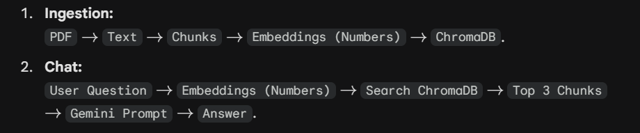

# Engineering Log: InsightPDF

## Created the Foler and file elementary structure

## [Date: 02-02-2025] - Session 1: The AI Core
**Goal:** Implement the basic RAG pipeline (Ingestion + Retrieval) in Python.

### Things I learned
**RAG:** - So RAG (Retreival Augmented Generation) is simply giving AI a open book, so that it can update its knowledge and generate better answers. 
    Retrieval - Find info
    Augment - Use this info to update knowledge
    Generate - Generate new answer

**LangChain** - It is a way to chain together different AI tools together

### How did I make it

**Step 1** - I defined the libraries to setup the RAG Engine
    => _Loaders and Splitters_ - They'll load text from document and split them into chunks

    => _The AI Models_ - Used Gemini for the main BRAIN and HuggingFace for embeddings

    => _DB and Parsers_ - Used for storing and prompting the engine

**Step 2** - Defined a class RagEngine

    **Step 2.1** - 

